# Iosevka Mayukai: a Custom Build of Iosevka

This repository contains TTF files containing modifications as a custom build of the original Iosevka font. All weight and style variants from the original font are available: Regular, Italic, weights from 100 to 900, and Bold. This build also supports all ligatures from the original Iosevka font. We took the fonts Iosevka SS04 (Menlo), Iosevka SS07 (Monaco), Iosevka SS09 (Source Code Pro), Iosevka SS12 (Ubuntu Mono), Iosevka SS14 (Jetbrains Mono), Hack Font Style, and the Nerd Font patcher to make this custom build of Iosevka, named Iosevka Mayukai.

## Font Variants

Iosevka Mayukai is a subfamily of style-varying fonts with ligatures, suitable as a programming font for text editors and IDEs. The variants available are as follows:

- **Iosevka Mayukai Original** is a variant with the combination of Iosevka SS04 (Menlo), Iosevka SS07 (Monaco), and Iosevka SS12 (Ubuntu Mono).
- **Iosevka Mayukai Serif** is a variant with the combination of Iosevka SS09 (Source Code Pro), Iosevka SS12 (Ubuntu Mono), Iosevka SS14 (Jetbrains Mono), and the Hack font style.
- **Iosevka Mayukai Codepro** is a variant with the combination from Iosevka SS15 (IBM Plex Mono) and Iosevka SS18 (Input Mono).
- **Iosevka Mayukai Monolite** is a variant with the combination of Iosevka SS16 (PT Mono), Iosevka SS17 (Recursive Mono), and Iosevka SS05 (Fira Mono) with complete ligature support.
- **Iosevka Mayukai Sonata** is a variant with the combination of Iosevka SS18 (Input Mono) and Iosevka SS03 (Consolas).
- **Iosevka Mayukai Firastorm** is a variant with the combination of Iosevka SS17 (Recursive Mono) and Iosevka SS05 (Fira Mono).

Each variant has its own separate bundle. There are bundles with and without ligations. For code editors or IDEs, the bundles named `IosevkaMayukaiXXXEditor-vXXX.zip` should be used. Such bundles include fonts with built-in ligatures and glyph ligations from Iosevka.

For terminals, the bundles named `IosevkaMayukaiXXXTerminal-vXXX.zip` should be used. Such bundles include monospace fonts **without ligations**. Additionally, Nerd Fonts-patched variants with complete glyph and powerline variants are available in the `nerd-patched-ttf` folder. Such variables are suitable for terminals like Spaceship, Starship, and Powerlevel10K. These font variants have been patched using [Nerd Font Tools by Ryanoasis](https://github.com/ryanoasis/nerd-fonts).

WOFF files are available for each variant, which can be used in web pages.

## Font Samples

Here are sample screenshots for each font variant, which can be seen below.

### Iosevka Mayukai Original

#### Regular

#### Italic

### Iosevka Mayukai Serif

#### Regular

#### Italic

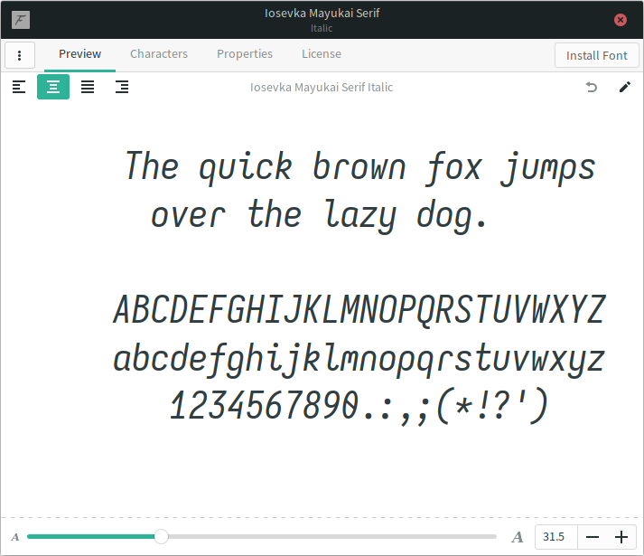

### Iosevka Mayukai Codepro

#### Regular

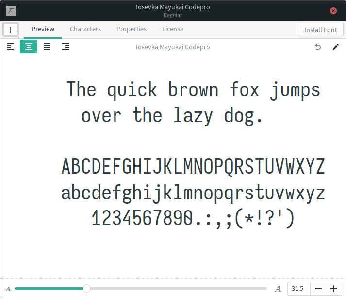

#### Italic

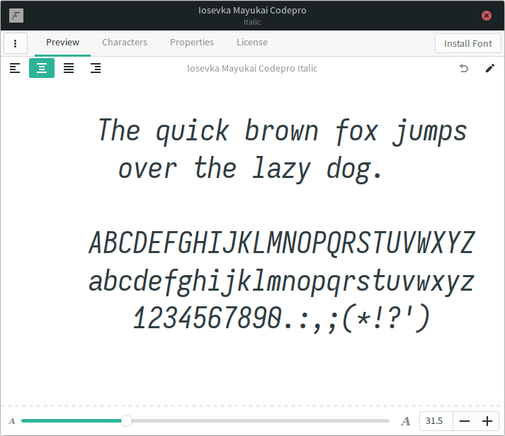

### Iosevka Mayukai Monolite

#### Regular

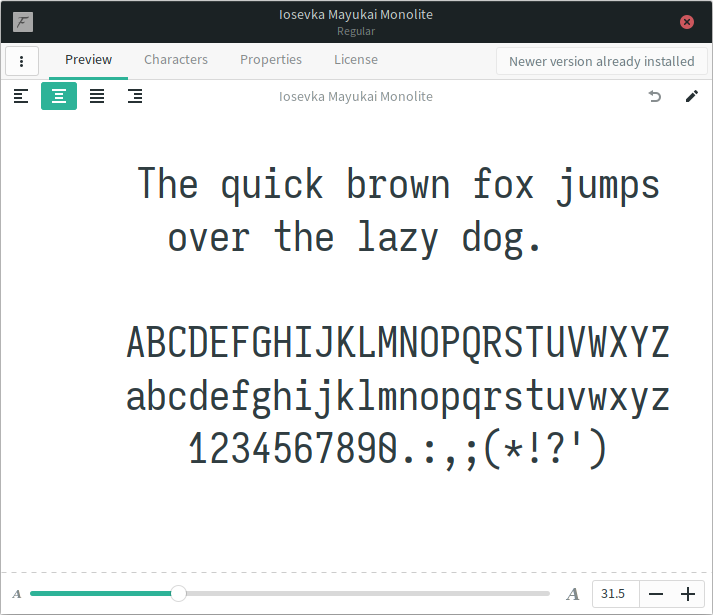

#### Italic

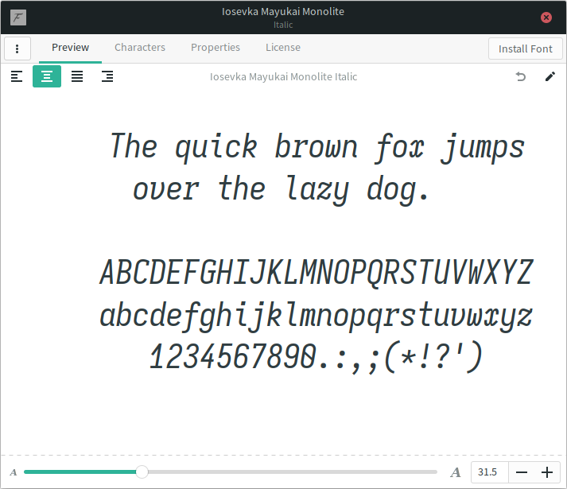

### Iosevka Mayukai Sonata

#### Regular

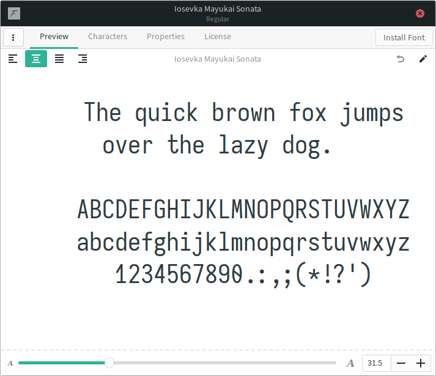

#### Italic

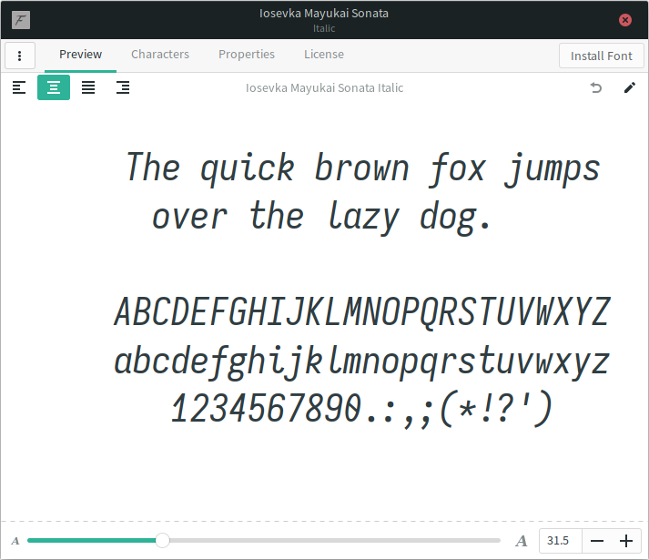

### Iosevka Mayukai Firastorm

#### Regular

#### Italic

## Download and Installation

Download the fonts from the [Releases page](https://github.com/Iosevka-Mayukai/Iosevka-Mayukai/releases) of this repository. Unzip and open the `IosevkaMayukaiXXX-vXXX` folder.

- **Instruction for Linux**: Copy the folder with the TTF files into your fonts directory, which is usually in your home directory at `~/.local/share/fonts/`. To install it system-wide, you may copy it over to `/usr/share/fonts/truetype` instead. From there on, run `sudo fc-cache -f -v` to refresh the font caches in your system.
- **[Instructions for MacOS](http://support.apple.com/kb/HT2509)**: Right click on each TTF font file, and install with the FontBook App.
- **Instructions for Windows**: Download the fonts from the [Releases page](https://github.com/Iosevka-Mayukai/Iosevka-Mayukai/releases), select and right-click the font files, then hit "Install".
  - On Windows 10 1809 or newer, fonts are installed per-user for the local user by default. This may cause compatibility issues for some applications, mostly ones written in Java. To cope with this, right-click and select "Install for all users" instead. [(Reference)](https://youtrack.jetbrains.com/issue/JRE-1166?p=IDEA-200145)

## Settings for Code Editors

Open your code editor's font settings, and input the font variant's name into the font selection. Save and reload your code editor. If it doesn't work, try writing the font's name with dashes: `"Iosevka-Mayukai-<variant>"`.

For Iosevka Mayukai Original, input `"Iosevka Mayukai Original"` into the editor's font settings. For MacOS and Windows, try inputting `"Iosevka-Mayukai-Original"` in case the former failed.

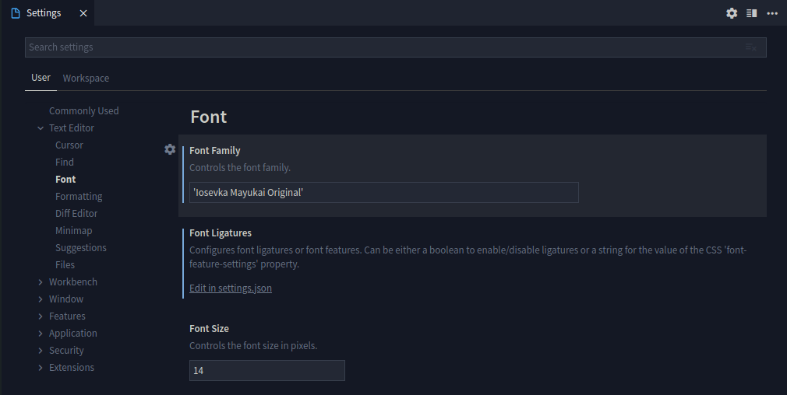

For Iosevka Mayukai Serif, input `"Iosevka Mayukai Serif"` into the editor's font settings. For MacOS and Windows, try inputting `"Iosevka-Mayukai-Serif"` in case the former failed.

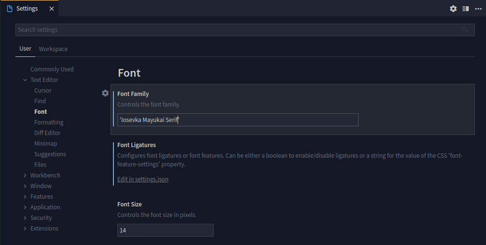

For Iosevka Mayukai Codepro, input `"Iosevka Mayukai Codepro"` into the editor's font settings. For MacOS and Windows, try inputting `"Iosevka-Mayukai-Codepro"` in case the former failed.

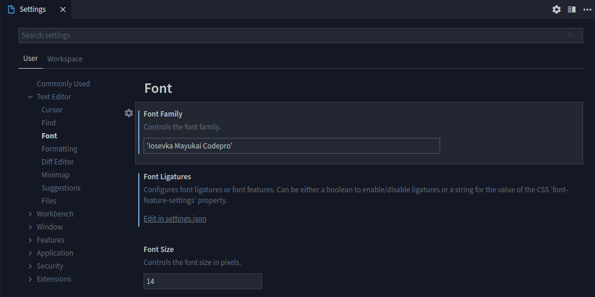

For Iosevka Mayukai Monolite, input `"Iosevka Mayukai Monolite"` into the editor's font settings. For MacOS and Windows, try inputting `"Iosevka-Mayukai-Monolite"` in case the former failed.

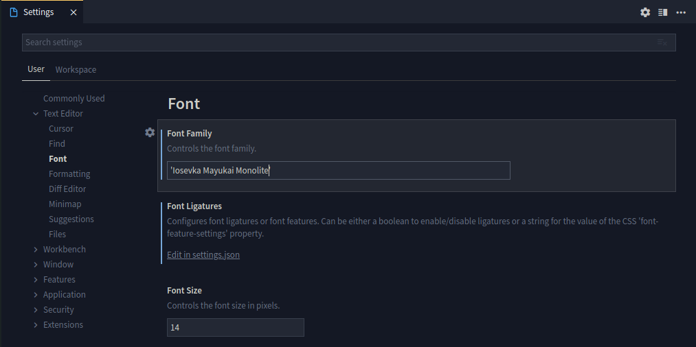

For Iosevka Mayukai Sonata, input `"Iosevka Mayukai Sonata"` into the editor's font settings. For MacOS and Windows, try inputting `"Iosevka-Mayukai-Sonata"` in case the former failed.

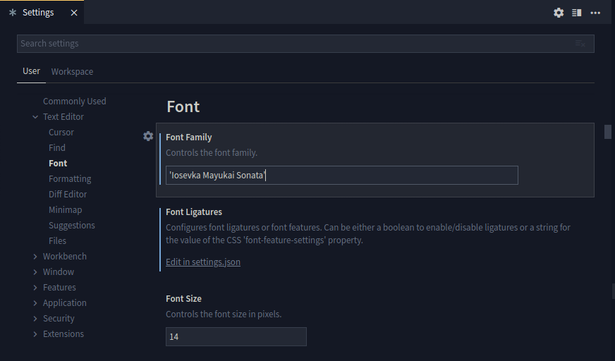

For Iosevka Mayukai Firastorm, input `"Iosevka Mayukai Firastorm"` into the editor's font settings. For MacOS and Windows, try inputting `"Iosevka-Mayukai-Firastorm"` in case the former failed.

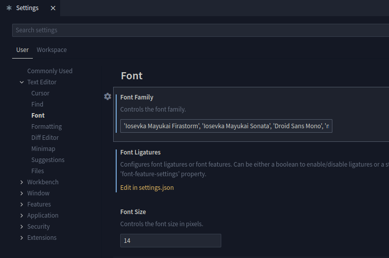

### Nerd Font Variants

If you're using the Nerd Fonts-patched variants, you should select or use `"Iosevka Nerd Font"` in your terminal's font settings. This will provide the patched glyphs and icons from Nerd Fonts. These variants are named `Iosevka Mayukai XXX Nerd Font Complete` and are located inside the `nerd-patched-ttf` folder. Do note that the Nerd Fonts variants are provided with **no ligation**.

## Demo

Below are demonstrations of the Iosevka Mayukai font on VS Code, using Iosevka Mayukai Semibold (weight: 500) and Iosevka Mayukai Medium (weight: 600). The theme that is being used in these demonstrations is the [Mayukai Theme](https://marketplace.visualstudio.com/items?itemName=GulajavaMinistudio.mayukaithemevsc), available over in the VS Code Marketplace.

### Iosevka Mayukai Original

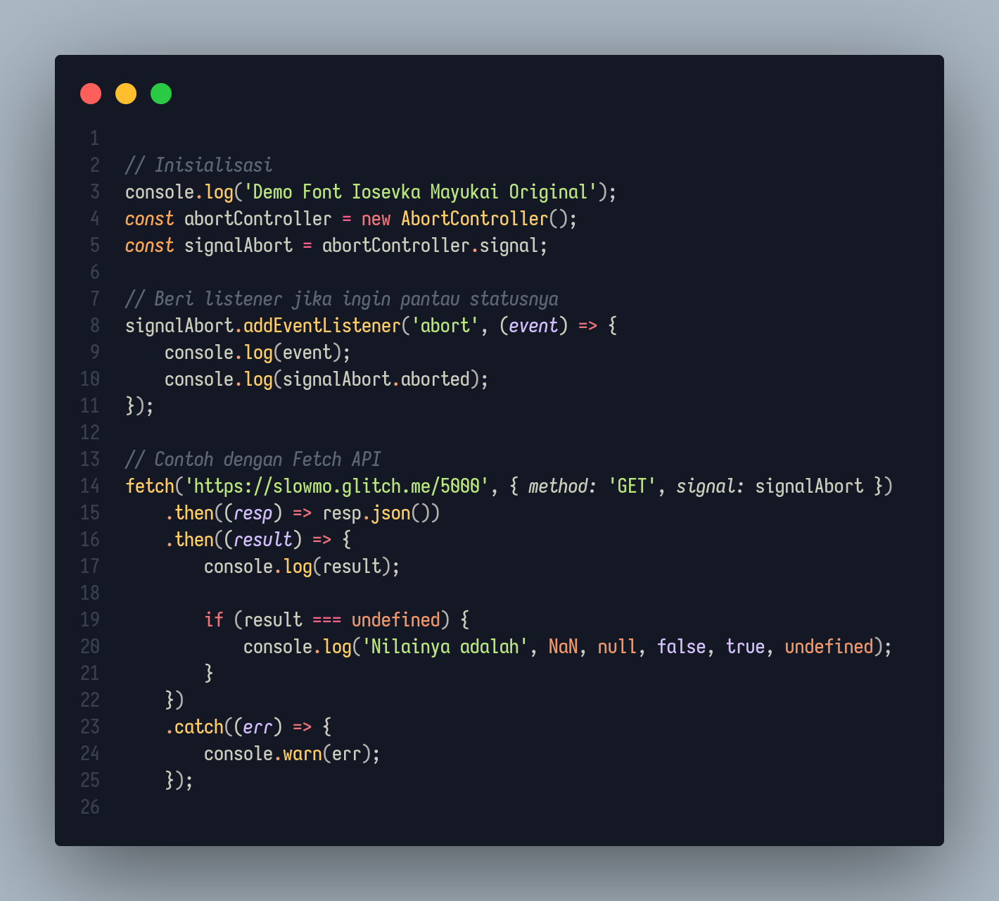

### Iosevka Mayukai Serif

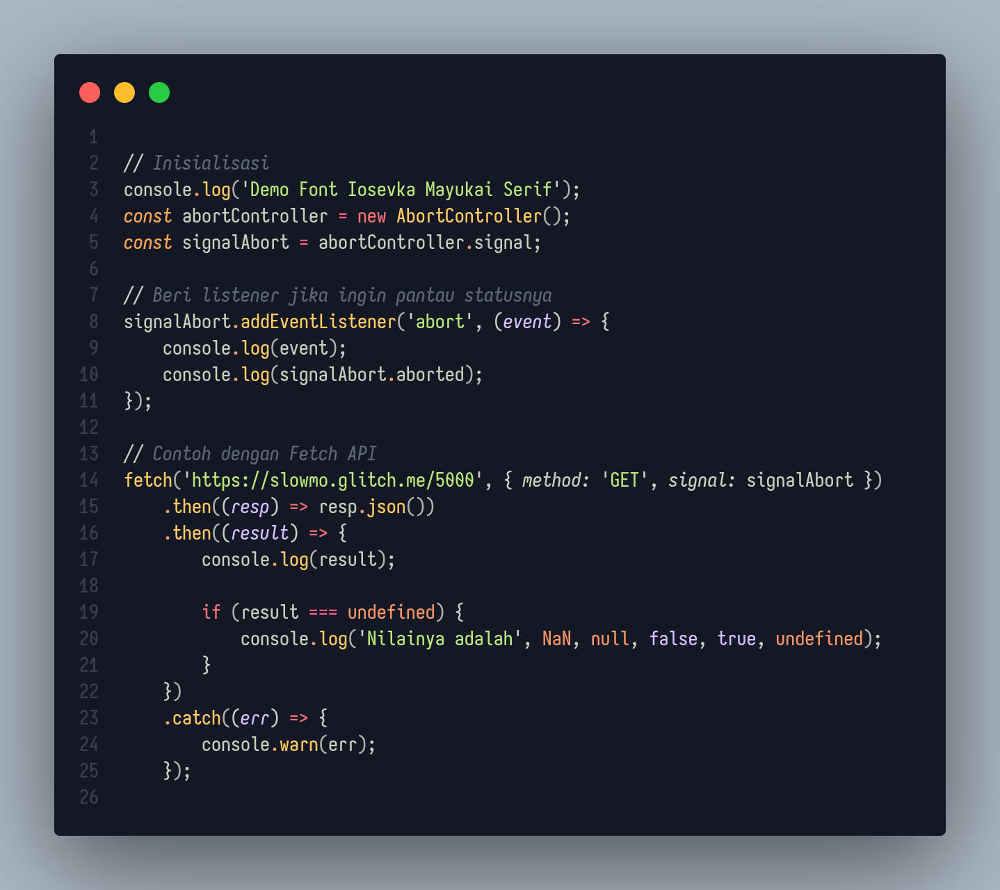

### Iosevka Mayukai Codepro

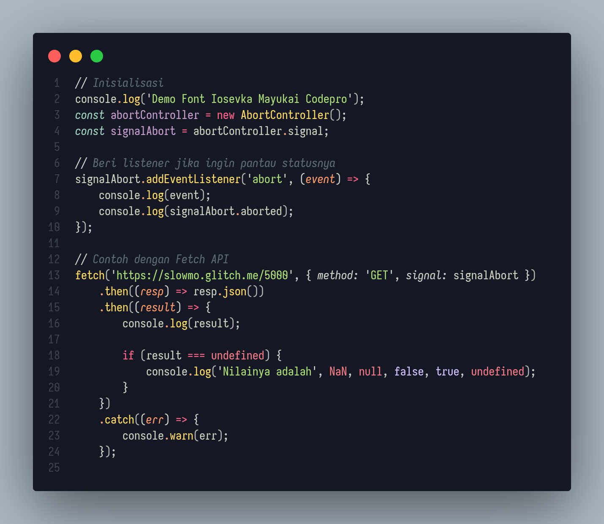

### Iosevka Mayukai Monolite

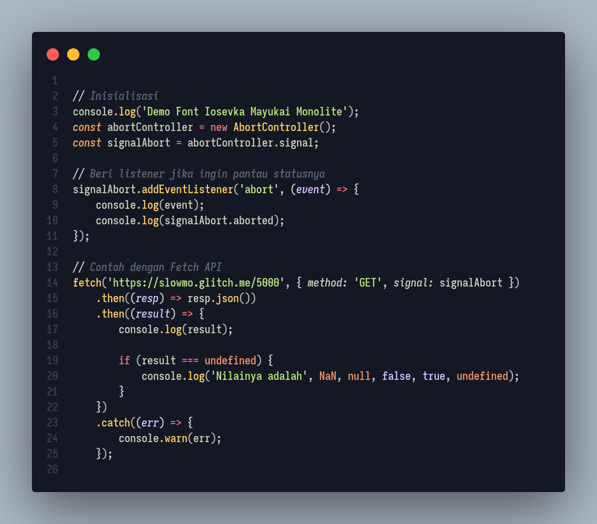

### Iosevka Mayukai Sonata

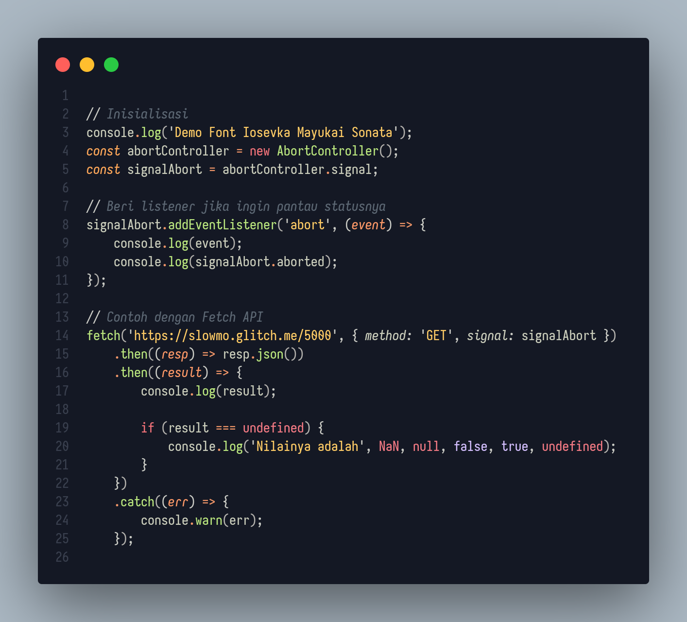

### Iosevka Mayukai Firastorm

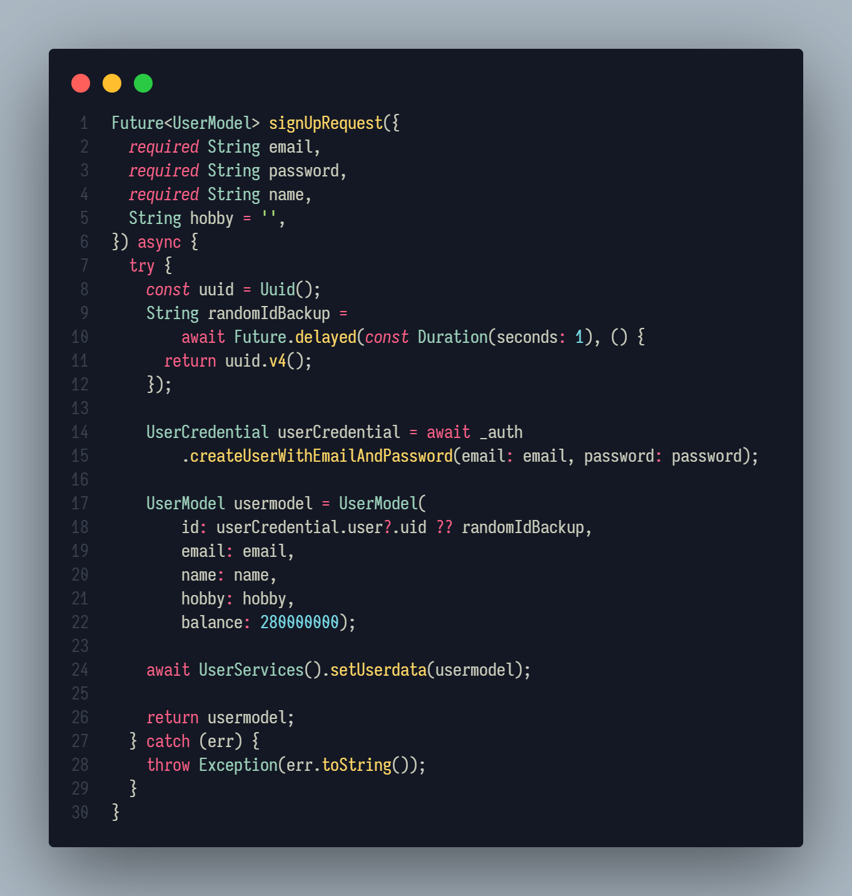

## Build Instructions

The build plans for the font are available in a [different repository](https://github.com/Iosevka-Mayukai/HowToBuild) if you want to build or customize it by yourself. Afterwards, you can check out the [documentation for building Iosevka](https://github.com/be5invis/Iosevka#building-from-source).

## Appreciations

Thank you for Belleve Invis, their developers, and the contributors who made Iosevka possible. Don't forget check out and download the original Iosevka font at its repository [here](https://github.com/be5invis/Iosevka)! You can visit its [demo page](https://typeof.net/Iosevka) for further details.
